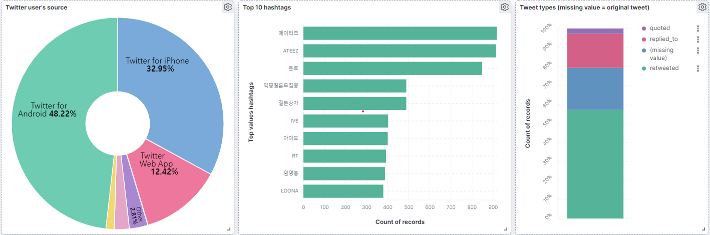

# simple-twitter-kafka-elk_docker-compose
simple twitter-kafka-elk with docker-compose.

# 목적

- 트위터 API를 이용한 실시간 streaming 데이터를 카프카-ELK로 흐르게 하는 파이프라인 구성.
- 카프카와 ELK 스택을 직접 사용해보고 이해하기.

트위터 API를 통해 받은 실시간 데이터를 카프카로 Produce,
Kafka의 데이터를 Logstash 를 활용해 Consume 하고 Elasticsearch로 전송,
Elasticsearch 에서 받은 데이터를 확인하고 Kibana Dashboard를 통한 시각화까지 경험.

# Settings

./src/.env 파일 수정.
developer.twitter.com 에서 키를 발급받고 각각 맞는 Key에 복사 후 사용.

# Usage

```bash
docker-compose -f ./docker-compose.yml up -d
python ./src/main.py
```

# Kibana Visualization

